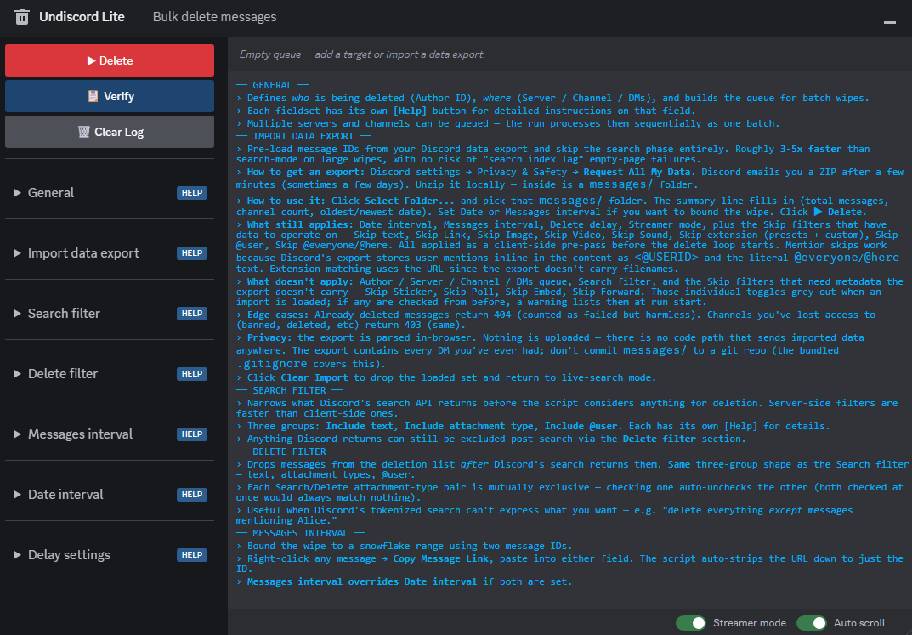
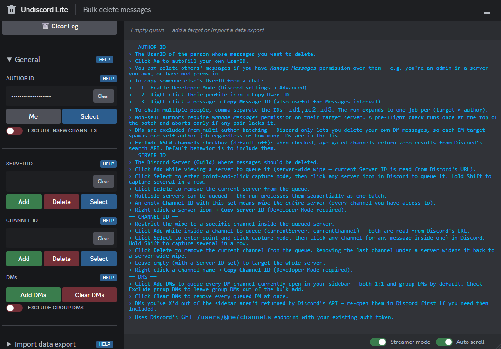
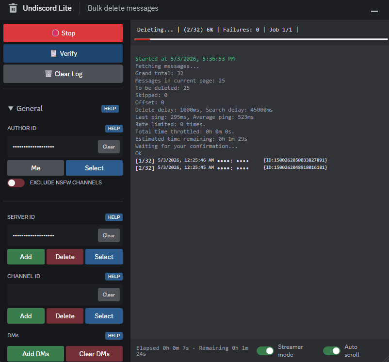
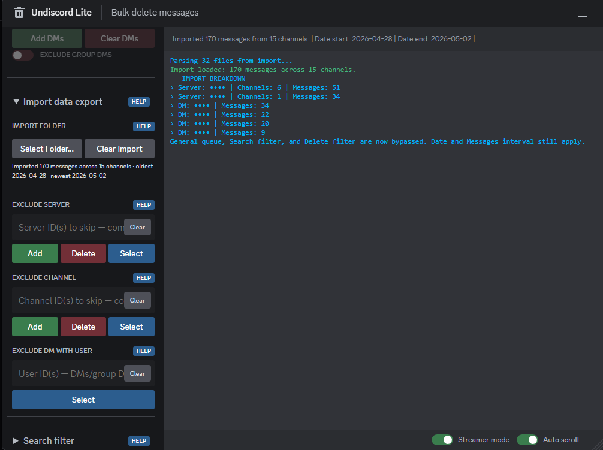

# Undiscord Lite

Bulk-delete your messages in Discord servers, channels, and DMs. A zero-dependency rewrite of [victornpb/undiscord](https://github.com/victornpb/undiscord).

**Contents:** [Preface](#preface) · [Features](#features) · [Install](#install) · [Usage](#usage) · [Import mode](#import-mode) · [How it works](#how-it-works) · [Privacy](#privacy) · [Build](#build) · [Disclaimer](#disclaimer) · [Credits](#credits)

## Preface

Started as a personal-use rewrite of victornpb's Undiscord, now expanded for distribution to the general public.

The original lacked some serious core functionalities, polish, and support for issues is pretty dead. It was also way too bloated and reliant on like a dozen+ node modules for the basic task it was performing. This version is about 30x lighter and uses exactly ZERO modules or imports. Everything is built in-house. Nothing is obscured or imported, everything is auditable directly.

⚠️ DON'T TRUST RANDOM CODE FROM THE INTERNET WITHOUT UNDERSTANDING WHAT IT DOES AND HOW IT DOES IT! ⚠️

That was the main impetus for my own rewrite — 12+ dependencies was far too much obfuscation for my taste. I ripped it to atoms and reconstructed a version that I built, verified, and can PERSONALLY 100% trust with my precious sensitive Discord data.

That said, I tried my best to be as transparent as possible. If I were ever going to publish some garbage I made, it might as well be this thing I like using. In the eternal words of Todd Howard, that will *surely* never come back to haunt me — it just works.

Honestly *astounding* that this all isn't a native Discord feature. You can fit a small country's population into a single server but comprehensive privacy options and >10 MB uploads are too much to ask for.

Deleting your account doesn't wipe the messages either: if you lose access to a server before cleaning, they're just there forever being displayed at the owner's mercy, since the API needs channel-level access to work. Getting banned or kicked 403's you out of making the API request FOREVER.

"DELETED_USER says: Hi I'm Michael Michaelson!"

Peak anonymity. Worry not, there are options. For some.

Read:

- [How long Discord keeps your information](https://support.discord.com/hc/en-us/articles/5431812448791-How-long-Discord-keeps-your-information) — official support article
- [Local-law addenda](https://discord.com/terms/local-laws#5) — region-specific TOS clauses
- [Privacy Policy](https://discord.com/privacy%20policy) — the headline document

If you live in the EU (Yes, including the Yookay.), Switzerland, South Korea, or Brazil and are worried about what you posted in a server you no longer have access to, you can exercise your legal right to have your data DELETED directly.

I recommend you do this every now and again regardless, since deleting a message in Discord does NOT force them to pry it from the hungry mouths of their growing AI datacenter abominations.

The best way to go about this, especially in the EU, is to email the data protection officer directly at `dpo@discord.com`. Ask the question to `privacy@discord.com` if you're unsure of how it works in your jurisdiction. Send the email from the address associated with your Discord account for faster service. Archive your correspondence. If they get caught ignoring legal obligations you'll have proof that you were harmed by their misconduct. 

If you live in the US however…


You're fully at the mercy of the TOS of the super corpo Discord Inc. they have for countries without real data privacy laws.

They *might* honor your request if you say pretty please and write them a nice email. Maybe Venmo support a tip and include a prayer for their sickly mother. But other than that, the best you can do is prevent getting into that situation to begin with — wipe your messages at least once a week. And even then, anything that's already in their training pipeline is doomed to ride out the next couple of years inside an AI dataset.

I only plan to update it if it breaks severely, there are enough safety guards built in to survive most changes to Discord with graceful degradation of the convenience features while retaining core functionality.

## Features

- **Zero npm dependencies.** The build is a single ~310-line Node script — no rollup, no plugins, no `node_modules`. The bundled userscript runs with no external dependencies, so there's nothing to audit beyond the file itself. Size went down from ~7 MB to ~250 KB.

- **Multi-server / multi-channel batching** with `Add` / `Select` / `Delete` controls and a live queue display. The original technically supported batching — comma-separated channel IDs in one input for channels only — but it was basically undocumented and miserable to use manually. Dedicated buttons and a smarter queue let you mix entire-server wipes with channel-specific entries however you want.

- **Batch Selection (queue of queues).** Build one selection — targets, filters, intervals — click `Batch Selection +` to snapshot it, then build a totally different one and snapshot that too. Click `▶︎ Delete` and every queued snapshot runs sequentially with its own settings. Useful when one wipe wants strict text matching and another wants attachment-only, or when one job is server-wide and another is a date-bounded DM cleanup — no more babysitting the form between runs. Pre-flight permission checks run at queue time so a bad snapshot is rejected before it's added; the confirmation prompt only fires on the first selection.

- **Point-and-click ID capture.** Hit `Select` on any field, then click an avatar / message / server icon / channel in Discord — the relevant ID drops into the field. Hold Shift to capture several in a row. Faster than Developer Mode + Copy ID for everything except cross-server lookups.

- **Discord data export import.** Pre-load message IDs from your Discord data export and skip the search phase entirely — roughly 3-5x faster on large wipes. See [Import mode](#import-mode) below.

- **Robust rate-limit handling** — monotonic delay bumps with half-life decay back to your chosen baseline. The original bumped the delay on a 429 and never reset it, leaving you crawling for the rest of the run. Now it decays back toward your stepper value as deletes succeed.

- **Auto-retry** on HTTP 5xx, network errors, and Discord's transient empty-page quirks. The original would die on a single empty page, an internet hiccup, or any Discord wobble. Each of those now has proper retry logic.

- **Robust user-flow handling.** The entire thing has been monkey-proofed as much as possible. Invalid inputs are clamped, invalid dates get restored, user permissions are checked before trying to delete other people's messages, text-boxes autoformat the inputs properly, and everything has a hover title plus an in-window help button that prints documentation to the log instead of redirecting to the GitHub.

- **Server-bar trash-icon injection** + `Ctrl+Shift+D` shortcut. The icon mounts inside Discord's left rail (between the Home/DM separator and the first server) and re-injects every second if React drops it. A floating action button in the bottom-right is the fallback when Discord's DOM doesn't expose the expected anchors. And if all that fails, Ctrl+Shift+D will always toggle the window so you're never soft-locked out by a UI problem.

- **Self-contained dark palette.** All colors are pinned to hardcoded hex values — the panel deliberately ignores Discord's CSS theme variables, so BetterDiscord/Vencord/custom themes can't make the UI look terrible. Single-source palette at the top of `styles.css` if you ever want to retune.

- **Defensive null handling** — run-instance fencing for stop+start races, log auto-trim at 1000 entries, interruptible sleeps so a Stop click doesn't have to wait for the current delay to elapse.

- **Filter overhaul** — splits filtering across two stages. The **Search filter** taps Discord's own search API to narrow down *what gets returned* — a powerful, underused tool that can pick 100 matching messages out of a million for processing. But it's include-only — every toggle adds a constraint to what comes back; there's no way to say "except the ones matching X." The **Delete filter** handles that side: a client-side post-pass over the returned messages that drops the ones you want to spare.

> **Example.** *"I want to delete every @Alice message I ever made in the server, except the ones with my hilarious memes."*
>
> Put `@AliceUserID` in mentions on the **Search filter** — this narrows the server-wide message pool down to (say) 100 that contain an @Alice mention. Flick **Image** on in the **Delete filter**, and the script walks those 100 posts and skips deleting the ones with an image attachment.

## Install

Install a userscript manager — [Tampermonkey](https://www.tampermonkey.net/) (recommended), [Violentmonkey](https://violentmonkey.github.io/), or Greasemonkey. Works in Chrome, Edge, Firefox, Safari, Opera, and most Chromium-based browsers.

> **Chromium browsers only** (Chrome, Edge, Brave, Opera, Vivaldi): open the extensions page (`chrome://extensions` or equivalent) and enable **Developer mode**. Manifest V3 requires it for userscript managers to run user code. Firefox and Safari users can skip this step.

Then install the script via either path:

- **Greasy Fork** *(easiest)* — visit the [Greasy Fork listing](https://greasyfork.org/en/scripts/576464-undiscord-lite) and click **Install this script**.
- **Direct from GitHub** — click **[undiscord-lite.user.js](https://github.com/OrbitalCheese/undiscord-lite/raw/master/undiscord-lite.user.js)**. Your userscript manager will detect the metadata banner and prompt you to install.

Open/reload Discord afterwards. A trash icon mounts in Discord's left rail just above the server list — click it (or press `Ctrl+Shift+D`) to open the panel. If Discord's DOM doesn't expose the expected anchors, a fallback floating action button appears in the bottom-right corner instead.

## Usage

Open the panel with the trash icon or `Ctrl+Shift+D`. The panel is draggable by its header and resizable from any edge or corner.



### Author ID

The Author ID field determines whose messages get deleted. Click **`Me`** to auto-fill your own user ID. Leave it empty and it defaults to your own at run time. You can paste a different user's ID, but Discord will only let you delete messages on channels where you have **Manage Messages** permission for that user (e.g. moderating your own server).

Comma-separate IDs (`id1,id2,id3`) to delete from multiple authors in one batch — the run expands to one job per (target × author). The pastebox auto-formats this when you paste in new ID's one at a time. Non-self authors require Manage Messages on each target server; a one-shot pre-flight check at the start of the batch verifies this and aborts early on any failure. In DMs you can only ever delete your own messages, so they spawn one self-author job regardless of how many IDs are listed.

### Building the queue

Server ID and Channel ID each have three control buttons plus a `Clear` button inside the input:

- **`Add`** — queues the current target. While viewing a server, `Add` on Server queues a server-wide wipe; while viewing a channel, `Add` on Channel queues that one channel (and pulls in its parent server).
- **`Select`** — enters point-and-click capture mode. The next click on a server icon / channel / message in Discord drops its ID into the field. Hold Shift to keep capturing without exiting.
- **`Delete`** — removes the current target from the queue. Removing the last channel under a server widens it back to a server-wide wipe.



Mix and match across as many servers as you want — order doesn't matter, the queue display groups everything by server.

**Server-wide vs channel-specific.** An empty Channel ID for a given server means "wipe the whole server." Adding a specific channel to a server already queued server-wide narrows it to just that channel. Adding a server-wide entry over channel-specifics absorbs them and resets that server back to a full wipe.

**DMs.** Open the DM in Discord and click `Add` on Channel. The Server field auto-fills as `@me`, the Channel field auto-fills with the DM ID — both pulled from Discord's URL.

**Wiping every DM at once.** Click the **`Add DMs`** button in the DMs fieldset. It calls Discord's own `GET /users/@me/channels` endpoint with your existing auth token and queues every DM (1:1 and group) currently open in your sidebar. Tick **Exclude group DMs** to skip the group ones.

> Only currently-open DMs are queued. Conversations you've X'd out of the sidebar aren't returned by that endpoint — Discord considers them minimized rather than active. Re-open the DM in Discord first, then click `Add DMs` again. Or import message data for a comprehensive wipe.

### Running

Hit **`▶︎ Delete`**. On the first job, a confirmation dialog shows you the estimated message count, estimated time, and a preview of what's about to be deleted. Subsequent jobs in the same batch don't re-prompt.

The trash icon (whether mounted in the server bar or shown as the fallback FAB) turns red while a run is active and shows a thin progress bar. Click **`🛑 Stop`** at any time — the in-flight delay aborts immediately, no need to sit through the current sleep.



### Batching multiple selections

Sometimes a single configuration isn't enough — one wipe wants strict text matching, another wants every attachment, a third is a date-bounded DM cleanup. Rather than running each manually and waiting, queue them up:

1. Build the first selection — set Author / targets / filters / intervals like normal.
2. Click **`Batch Selection +`** instead of Delete. The form snapshots into a queue (the `queued: N` chip in the sidebar shows the count) and resets to defaults so you can start the next one.
3. Build the next selection. Add it the same way. Repeat as many times as you want.
4. When you're ready, click **`▶︎ Delete`**. Every queued snapshot runs sequentially with its own captured settings; if the form is also non-blank when you click, that selection runs as the trailing entry.

**Pre-flight at queue time.** When a snapshot includes a non-self author, the permission pre-flight runs the moment you click `Batch Selection +` — so a bad snapshot (missing Manage Messages on some target server) is rejected before it gets queued. You'll never reach Delete and discover a snapshot was poisoned.

**Exact-duplicate block.** If you queue a selection that's byte-identical to one already in the queue, it's rejected with a log line — saves you from accidentally running the same wipe twice in a row.

**Soft redundancy warning.** Beyond exact duplicates, the queue checks if any earlier snapshot has filters at default and a scope/author/interval that fully covers the new one (or vice versa). If so, the new selection still queues but a warning logs that one of the two will be doing mostly-redundant work. Anything subtler than that — partial overlaps, filter-subset relationships — is left alone; you know what you queued.

**Single confirmation.** The browser confirm dialog fires only on the first selection. The user already confirmed the intent of the meta-batch when they hit Delete. Declining the first prompt aborts the entire meta-batch.

**`Reset Selection`** wipes the current form back to defaults without touching the queue, the log, or the streamer-mode / auto-scroll toggles. Useful when you want to discard the in-progress form without losing the snapshots you've already queued.

**`drop batches`** — the red chip next to the queue counter discards every queued snapshot in one click. Doesn't touch the current form. Use when you've queued a few and want to start over.

### Verify

**`📋 Verify`** prints a structured snapshot of the current run config to the log without starting anything. Mode (live / import), queue contents grouped by server, every active filter on both sides, both intervals, and the current delay values. Useful when you've toggled a lot of switches and want to sanity-check what `▶︎ Delete` will actually do before you click it.

The log isn't cleared — Verify is read-only and never destroys prior context. Sensitive IDs (author, server / channel, mentions, snowflake bounds) are dotted out under Streamer mode just like in the per-delete log.

### Settings

Collapsible sidebar sections:

- **General** — Author ID, Server / Channel queue, DMs. The **Exclude NSFW channels** checkbox under Author ID inverts Discord's `include_nsfw` search flag (default off; check to exclude age-gated channels from search results).

- **Search filter** — narrow what comes back from Discord's search: content text, attachment types (link / image / video / sound / sticker / poll / embed / forwarded), `@everyone / @here` pings, pinned mode, and a single `@user` mention.

- **Delete filter** — drops messages from the queue *after* the search returns them: skip-text (substring or exact-word), the same set of attachment toggles, `@everyone / @here`, and a list of `@user` mentions to skip.
  - **Skip extension** — eight preset pills for the most-shared file types (`.jpg .png .mp4 .webm .pdf .docx .txt .zip`) plus a custom semicolon-separated textbox for anything else (`.psd;.dmg;.iso`). Whitespace trimmed, case normalized, leading dots optional. Any single attachment match drops the whole message.
  - **Skip Image / Skip Video** category toggles auto-tick the matching extension presets (`.jpg`+`.png` / `.mp4`+`.webm`); unticking any preset clears the parent toggle.

> **@Mentions asymmetry.** The Search filter's <kbd>Include @user</kbd> field accepts **one** ID — Discord's `mentions=` query param only filters by a single mentioned user per request. The Delete filter's <kbd>Skip @user</kbd> field accepts **any number** of comma-separated IDs, because the skip is a client-side check after the response: every listed ID is matched against each message's mentions. So if you queue a 10k-message run and want to skip three @users, list all three on the Skip side and they'll all be honored in one pass.

> **Extension asymmetry.** Every other attachment toggle on the Search side (Link / Image / Video / Sound / Sticker / Poll / Embed / Forward) is a *server-side* filter — Discord's search API has a `has=<type>` query param for each one, so the narrowing happens before the response ever leaves Discord's database. **Skip extension has no Search-filter counterpart** because Discord's API doesn't expose extension-level filtering — there's no `has=jpg` or `extension=mp4`. So Skip extension is purely *client-side*: the script runs the normal search, then walks every returned message's attachment list locally and drops the matches before issuing the deletes. Same shape as the @user asymmetry above — server-side narrow-down has hard limits, client-side fine-grained skips fill the gaps.

- **Messages interval** — min/max snowflake IDs to bound the deletion. Right-click a message in Discord → Copy Message ID. Useful for "delete everything I posted after this point" or "only the last week."

- **Date interval** — datetime pickers, auto-converted to snowflakes. Ignored if you also fill in Messages interval — the snowflake range wins.

- **Delay settings** — search delay (default 45s) and delete delay (default 1s) steppers set your *baseline*. Click the arrows or type a value directly (auto-clamped to the field's range). The script auto-bumps both on 429s and decays back toward it as deletes succeed. Lower delays = faster, but more throttling.

- **Import data export** — pre-load message IDs from your Discord data export and skip the search phase entirely (~3-5x faster on large wipes; no search-index-lag failure modes). See [Import mode](#import-mode) below.

> Discord's UI requires dev mode to be on to copy raw message IDs — only a message *link* can be copied otherwise. The textbox auto-strips the link down to the message ID, so you *can* just paste it in there with no problems.
>
> Around 30s is the practical floor for the search delay. Below that, Discord returns smaller batches per call until you're retrying more often than deleting. **40-45s search + 0.5–1s delete** is the sweet spot for consistent results.

## Import mode

If you've already requested your Discord data (User Settings → Privacy & Safety → **Request All My Data**), the resulting ZIP contains a complete index of every message you've ever sent. Import mode reads that index directly and skips Discord's search API entirely — turning a multi-hour wipe into a lightning fast delete-only run.



**How to use it:**

1. Request your data export from Discord. It arrives as a ZIP via email after a few minutes to a few days.
2. Unzip it locally. Inside is a `messages/` folder.
3. Open the panel's **Import data export** section. Click **Select Folder...** and point at that `messages/` folder.
4. The summary line fills in: total messages, channel count, oldest/newest timestamp.
5. Set your Date or Messages interval if you want to bound the wipe (e.g. "only delete posts older than 1 year"). These are applied client-side before the run starts.
6. Click **▶︎ Delete**. The General queue and Search filter sections grey out — the import IS the queue. The Delete filter stays interactive, but individual toggles that need data the export doesn't carry (Sticker, Poll, Embed, Forward) grey out individually.

**What still applies in import mode:**
- Date interval and Messages interval (pre-pass; only matching records get queued).
- Skip text (substring or exact-word match against message content).
- Skip Link / Image / Video / Sound (URL-extension MIME inference against attachment list).
- Skip extension (presets + custom semicolon-separated list) — extension is taken from the attachment URL.
- Skip @user / Skip @everyone/@here — Discord's export keeps user mentions as `<@USERID>` (and `@everyone`/`@here` as literal text) inline in `Contents`, so a content regex recovers them.
- **Exclude Server / Channel / DM-with-User** — three import-only fields right under the folder picker. Comma-separated snowflake IDs (Server accepts `@me` too — useful for "drop every DM"). Each has a `Select` button for point-and-click capture (Shift to capture several in a row) and a `Clear` button. Server matches against `guildId`, Channel against `channelId`, User against the channel's `recipients` list (so any group DM containing that user is dropped).
- **Exclude all** wildcards — three pill toggles below the import summary (`Exclude servers`, `Exclude DMs`, `Exclude group DMs`) drop entire categories without listing IDs. Convenient when you want to wipe only DMs from a multi-year export, or only servers, or only group DMs. Stacks with the per-ID exclusions above — anything dropped by a wildcard is attributed to its own bucket in the run-start breakdown.
- Delete delay (paces the actual DELETE requests).
- Streamer mode (redacts message content *and* usernames in the log + confirmation preview).

**What doesn't apply:**
- Author / Server / Channel / DM queue fields — replaced by the import.
- Search filter (no API call to filter).
- Skip filters that need metadata the export doesn't carry: Sticker, Poll, Embed, Forward. If any of these are checked when an import is loaded, a warning lists them at run start so silent no-ops aren't surprising.
- Search delay (no search call).

**Edge cases:**
- Messages already deleted (by you, by mods, by Discord) → 404 on DELETE; counted as failed but harmless.
- Channels you've since lost access to (banned, channel deleted, server deleted) → 403; same treatment.
- Group DMs and one-on-one DMs are included if your export contains them. (Excluding just *one* participant of a group DM will skip the whole group.)

**Privacy:** the export is parsed locally in your browser (`FileReader.text()`). Nothing is uploaded — there is no code path that sends imported data anywhere. The same `grep` rules in the [Privacy](#privacy) section catch any regression of this guarantee.

## How it works

A walkthrough of what happens after you click `▶︎ Delete`. Every step lines up with a function in the source so the trail is easy to follow.

1. **Auth token capture.** The script reads your Discord token from Discord's own `localStorage` via a same-origin iframe — the same token Discord's UI uses, from the same place. Never typed, never persisted by this script. *(`getToken()` in `src/helpers.js`.)*

2. **Queue resolution.** The Server ID and Channel ID fields are parsed into a list of `(server, channel)` jobs. An empty Channel ID for a given server means "wipe the whole server." DMs are queued as `(@me, <DM channel ID>)`. *(`parseTargets()` in `src/undiscord-ui.js`.)*

3. **Per-job loop.** For each queued target, the loop repeats: *(`run()` in `src/undiscord-core.js`.)*
   - **Search** — `GET /api/v9/guilds/<id>/messages/search` returns one page of matching messages. Page sizes are content-bounded (Discord caps somewhere near 25 but smaller pages are common on long-content channels). In **import mode**, this step is skipped — pages come from an `ImportSource` over the in-memory list parsed from your data export.
   - **Filter** — drops system messages and (by default) pinned messages, then runs all client-side `Skip ...` toggles. *(`filterResponse()`.)*
   - **Confirm** — first time only, a browser `confirm()` dialog shows the estimated count, ETA, and a content preview. Subsequent pages and jobs proceed silently.
   - **Delete** — issues `DELETE /api/v9/channels/<id>/messages/<id>` for each remaining message, sleeping `deleteDelay` ms between (default 1s). *(`deleteMessagesFromList()` and `deleteMessage()`.)*
   - **Wait** — sleeps `searchDelay` ms (default 45s) before the next page. Discord's search index lags real-time deletion; faster pacing returns smaller batches and triggers more retries. Skipped in import mode (no API call to pace).
   - **Repeat** — until the search returns empty (or the source is exhausted, or the empty-page retry budget runs out).

4. **Rate-limit handling.** On HTTP 429, the script reads `retry_after`, sleeps for that interval, and bumps its effective delay to match. Each subsequent successful response halves the delay back toward the stepper baseline (half-life decay). On 5xx or network error, it retries with exponential backoff (1s, 2s, 4s).

5. **Stop.** Clicking 🛑 Stop sets `running=false` and aborts the in-flight sleep. The loop exits at its next checkpoint, prints the end-summary, and resets the UI. *(`stop()`.)*

Every step that touches the network is one of four `fetch()` calls listed in the [Privacy](#privacy) section below. There is no other network I/O.

## Privacy

> ⚠️⚠️⚠️ **Common-sense warning** ⚠️⚠️⚠️
>
> **DON'T TRUST ANYTHING I SAY IN THIS SECTION BLINDLY WITHOUT VERIFYING AND UNDERSTANDING IT FIRST.**
>
> Running unverified code off the internet is a recipe for disaster. Independently verify every claim made below. Don't run the code if you don't understand what it's doing, or don't trust the source.
>
> I am just some guy on the internet. I am NOT a trust-worthy source.

**Short version:** your auth token is never stored, never logged, and never sent anywhere except `discord.com`.

The longer version, in case you want to verify it yourself (you should):

- **Where the token comes from.** Read from Discord's own `localStorage` via a same-origin iframe (Discord blocks direct page access, but iframes inherit the parent origin's storage — standard workaround). Same token Discord's own client uses.
  - `getToken()` — [`src/helpers.js:130`](src/helpers.js#L130)
  - iframe storage helper — [`src/helpers.js:121`](src/helpers.js#L121)

- **Where the token goes.** Held in a JavaScript variable (`options.authToken`) for the duration of the run. Used only as the `Authorization` header on `fetch()` calls to `https://discord.com/api/v9/...`. The codebase has exactly four `fetch()` call sites — search, delete, the DM-list lookup behind the `Add DMs` button, and the pre-flight permission check for multi-author batching — all four pointing at `discord.com`.
  - `authToken` field declaration — [`src/undiscord-core.js:37`](src/undiscord-core.js#L37)
  - search call — [`src/undiscord-core.js:488`](src/undiscord-core.js#L488) *(Authorization header at [line 519](src/undiscord-core.js#L519))*
  - delete call — [`src/undiscord-core.js:755`](src/undiscord-core.js#L755) *(Authorization header at [line 757](src/undiscord-core.js#L757))*
  - DM-list lookup — [`src/undiscord-ui.js:584`](src/undiscord-ui.js#L584) *(Authorization header at [line 585](src/undiscord-ui.js#L585))*
  - permission pre-flight — [`src/undiscord-ui.js:1704`](src/undiscord-ui.js#L1704) *(Authorization header at [line 1705](src/undiscord-ui.js#L1705))*
  - verify yourself — should return exactly four hits, all under `discord.com`:
    ```bash
    grep -rn 'fetch(' src/
    ```
  - *Line numbers may drift between releases. If a link is off, search the file for the symbol — it's the most reliable anchor.*

- **Where the token doesn't go.** Never written to `localStorage`, `IndexedDB`, cookies, files, or any other persistent storage. Never serialized into the log area. Never sent to GitHub, Greasy Fork, the author, an analytics service, or anything else — there is no code that talks to anything other than `discord.com`. Closing the tab clears it from memory.
  - verify yourself — zero hits expected:
    ```bash
    grep -rEn 'localStorage\.setItem|indexedDB|document\.cookie|navigator\.sendBeacon' src/
    ```

- **No telemetry, no analytics, no update beacons.** Update checks happen at the userscript-manager layer (Tampermonkey, Violentmonkey, etc) if this repo ever gets updated, never from inside this script.
  - verify yourself — only the four `discord.com` fetches above should appear:
    ```bash
    grep -rEn 'fetch\(|XMLHttpRequest|WebSocket|sendBeacon' src/
    ```

- **No third-party code, fully self-contained.** Zero `npm` dependencies, zero `@require` directives, no remote script injection. `@grant none` means no `GM_*` privileges, no CSP bypass, no cross-origin reach beyond what a normal page script has. The bundle has no ``, `<link>`, `<script>`, `@font-face`, `@import`, or `url(http...)` references — every icon is inline SVG, every font/emoji falls through to system fonts, every color is hardcoded hex.
  - userscript metadata banner — [`undiscord-lite.user.js:1-11`](undiscord-lite.user.js#L1-L11) (`@grant none`, no `@require`)
  - dependency manifest — [`package.json`](package.json) (no `dependencies` or `devDependencies` blocks)

- **What gets logged locally.** The panel's log shows usernames, message content, attachment metadata, and message IDs as items are deleted (so you can confirm what's happening). It's rendered into the DOM in your own tab — not transmitted, not persisted, and wiped when you click **Clear Log** or close the tab. Auto-trims at 1000 entries.
  - log renderer — [`src/undiscord-ui.js:1584`](src/undiscord-ui.js#L1584) (`printLog`)
  - auto-trim limit — [`src/undiscord-ui.js:1581`](src/undiscord-ui.js#L1581) (`LOG_MAX_ENTRIES`)

- **Auditable.** The bundled script is ~3,750 lines of readable JavaScript in one file ([`undiscord-lite.user.js`](undiscord-lite.user.js)). No minification, no obfuscation. Open it in any text editor before installing.

## Build

Modifying the source? One command, no install step:

```bash
node build.mjs
```

Outputs `undiscord-lite.user.js` at the repo root.

## Disclaimer

> ⚠️ Discord's terms of service forbid automated user-account actions (self-bots). Using this tool could result in account termination. Use at your own risk, on your own account, on your own data.

This tool only deletes messages owned by the account it's run on (or messages the account has the *Manage Messages* privilege over) via the same HTTP endpoints Discord's UI uses.

## Credits

Built on the work of [victornpb/undiscord](https://github.com/victornpb/undiscord). MIT-licensed.
